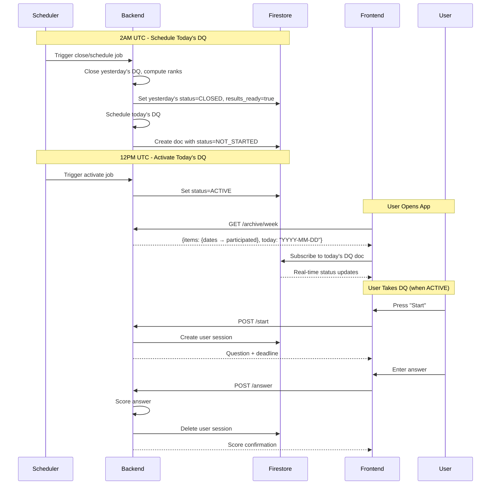

# Fermi API Architecture

This document describes the architecture, design decisions, and internal workings of the Fermi Game backend API.

## Table of Contents

- [Overview](#overview)
- [Project Structure](#project-structure)
- [Tech Stack](#tech-stack)
  - [Database Tables](#database-tables)
  - [Firestore Collections](#firestore-collections)
- [Authentication & Authorization](#authentication--authorization)
- [Error Handling](#error-handling)
- [Real-time Game State](#real-time-game-state)
  - [Game Document Schema](#game-document-schema)
  - [Subcollections](#subcollections)
  - [Game States](#game-states)
  - [Question Durations](#question-durations)
- [Game Flow](#game-flow)
  - [High Level](#high-level)
  - [Low Level](#low-level)
  - [Example Walkthrough](#example-walkthrough)
  - [Additional Logic](#additional-logic)
- [Design Decisions](#design-decisions)

---

## Overview

The Fermi API is a FastAPI application that exposes RESTful endpoints for The Fermi Game. It's comprised of four main services:

- **auth**: Authentication (token exchange) endpoint. Firebase integrated.
- **game**: Game-related endpoints for creating, joining, and playing games.
- **user**: User-related endpoints for profile and settings.
- **webhooks**: External service webhooks (RevenueCat for subscription management).

The backend uses a dual-storage approach:
- **PostgreSQL**: Stores questions, user history, answer analytics, and persistent data.
- **Firestore**: Manages real-time game state and synchronization.

---

## Project Structure

The project is organized into the following directories:

```
apps/fermi-api/
├── app/
│   ├── api/              # FastAPI routers (endpoints)
│   │   ├── auth.py
│   │   ├── game.py
│   │   ├── user.py
│   │   ├── question.py
│   │   └── webhooks.py
│   ├── core/             # Configuration and database setup
│   │   ├── config.py
│   │   └── database.py
│   ├── schemas/          # Pydantic models
│   │   ├── game.py
│   │   ├── auth.py
│   │   └── user.py
│   └── services/         # Business logic
│       ├── auth.py
│       ├── game.py
│       ├── user.py
│       └── subscription.py
├── static/               # Static assets (avatars, categories, difficulties)
├── tests/                # Test suite
│   ├── api/
│   ├── integration/
│   └── unit/
├── main.py               # Application entry point
└── pyproject.toml
```

**Key Principles:**
- **Thin API layer**: Routers handle HTTP concerns and delegate to services.
- **Service layer**: Contains all business logic and orchestration.
- **Clear separation**: Database access through `fermi-db` DAL, Firestore through Firebase Admin SDK.

---

## Tech Stack

### Database Tables

The game service uses the `fermi-db` Data Access Layer (DAL) to interact with PostgreSQL through `psycopg3`. Key tables:

- **`fermi_questions`**: Contains Fermi questions with answers and metadata.
- **`user_question_history`**: Tracks which players have seen which questions.
- **`answer_events`**: Contains answering events from all players.
- **`answers_quantiles`**: Materialized view of `answer_events` that computes quantiles of scores. This helps show quick stats to players on how they compare to others.
- **`questions_votes`**: Stores per-user upvotes/downvotes on questions.
- **`subscriptions`**: Tracks user subscription status and tier (synced from RevenueCat).

### Firestore Collections

The game service owns a Firestore `games` collection for real-time game-state management. The `games` collection contains all games as documents with the schema defined in `apps/fermi-api/app/schemas/game.py::GameDoc`.

**Key Features:**
- Real-time synchronization of game state
- Revealed subcollections for progressive information disclosure
- Player presence and progress tracking
- Efficient queries with `revealed=true` filtering

---

## Authentication & Authorization

Authentication is handled via JWT bearer tokens. Clients must first authenticate with Firebase and then exchange their token for a JWT access token via the `/auth/token` endpoint.

**Flow:**

1. Client authenticates with Firebase (e.g., Google Sign-In) and receives a Firebase ID token.
2. Client sends a `POST` request to `/auth/token` with the Firebase token in the `Authorization` header.
3. The backend verifies the Firebase token using Firebase Admin SDK.
4. If valid, backend creates or updates the user in PostgreSQL database.
5. Backend generates a JWT access token containing user information.
6. Client stores this access token and includes it in all future API requests as a bearer token (`Authorization: Bearer <ACCESS_TOKEN>`).

**Protected Endpoints:**

All game and user endpoints require a valid JWT access token. The backend validates the token on each request and extracts the user's `firebase_uid` for authorization checks.

---

## Subscription Management

The API integrates with RevenueCat to manage subscription tiers and feature gating.

### Architecture

- **Frontend**: RevenueCat Flutter SDK handles purchases and entitlement checks
- **Backend**: PostgreSQL `subscriptions` table stores subscription status synced via webhooks
- **Webhook**: RevenueCat sends events to `/api/v1/webhooks/revenuecat` when subscription status changes

### Subscription Tiers

- **FREE**: Default tier with limited features
- **PRO**: Premium tier with full feature access (lifetime, monthly, or annual)

### Webhook Flow

1. User purchases subscription via RevenueCat SDK in Flutter app
2. RevenueCat processes purchase and sends webhook event to backend
3. Backend validates webhook secret and updates `subscriptions` table
4. User's subscription tier is included in auth responses (`/auth/token`, `/auth/refresh`)

### Subscription Service

Located in `app/services/subscription.py`:
- `SubscriptionService`: Handles webhook events and updates subscription records
- Parses RevenueCat customer_info to extract tier, product_id, platform, expiration dates
- Updates subscription status on INITIAL_PURCHASE, RENEWAL, CANCELLATION, EXPIRATION events

### Database Schema

See [`packages/fermi-db/docs/SCHEMA.md`](../../packages/fermi-db/docs/SCHEMA.md#subscription-tables) for the `subscriptions` table schema.

---

## Error Handling

The API follows standard HTTP status code conventions:

**2xx (Successful):**
- `200 OK`: Standard response for successful requests.
- `201 Created`: New resource(s) created successfully.

**4xx (Client Errors):**
- `400 Bad Request`: Malformed request, invalid parameters.
- `401 Unauthorized`: Missing or invalid authentication token.
- `403 Forbidden`: Authenticated but not permitted (e.g., non-host trying to start game).
- `404 Not Found`: Resource doesn't exist (e.g., game ID not found).
- `409 Conflict`: Request conflicts with current state (e.g., joining started game, deadline passed).

**5xx (Server Errors):**
- `500 Internal Server Error`: Unexpected server condition.

All error responses include a JSON body with a `detail` field containing the error message.

---

## Real-time Game State

The entire state of a game is stored in a document within the `games` collection in Firestore. The frontend subscribes to real-time updates for the current game document to reflect changes in the UI.

**Key Principle**: While the frontend listens directly to the game's document, it uses queries to listen to the subcollections' documents (`questions`, `answers`, and `players_results`) where `revealed=true`. This ensures that the frontend only receives data that is intended to be visible to the players at that stage of the game.

### Game Document Schema

The structure of a game document is defined by the `GameDoc` schema (`apps/fermi-api/app/schemas/game.py`).

**Top-level Fields:**

- `id` (string): The game's unique identifier.
- `created_at` (timestamp): The time the game was created.
- `started_at` (timestamp, optional): The time the game started.
- `ended_at` (timestamp, optional): The time the game ended.
- `state` (number): The current state of the game (see [Game States](#game-states)).
- `n_questions` (number): The total number of questions in the game.
- `category` (string): The category of the questions in the game (requested category).
- `difficulty` (string): The difficulty of the questions in the game (requested difficulty).
- `question_uids` (array of strings): An ordered list of the UIDs for the questions in the game.
- `question_uid` (string): The UID of the current question.
- `question_number` (number): The number of the current question (1-indexed).
- `question_duration_s` (timestamp, optional): The duration of the current question.
- `host` (string): The `firebase_uid` of the host player.
- `players` (map): A map where keys are `firebase_uid`s and values are `GamePlayer` objects.
  - `GamePlayer` Schema:
    - `player_id` (string): The player's `firebase_uid`.
    - `name` (string, optional): The player's display name.
    - `picture` (string, optional): URL to the player's profile picture.
    - `score` (number): The player's current score.
    - `rank` (number): The player's current rank in the game.
    - `is_host` (boolean): Whether the player is the host.
    - `is_active` (boolean): Whether the player is currently active in the game.
- `full` (boolean): Whether the game is full and cannot accept new players.
- `progress` (map): An `AnswersProgress` object showing the progress of answers for the current question.
  - `AnswersProgress` Schema:
    - `answered` (map): A map where keys are `firebase_uid`s and values are booleans indicating if the player has answered.
    - `all_answered` (boolean): Whether all active players have answered the current question.
- `join_url` (string): The URL to join the game.
- `private` (boolean): Whether the game is private.
- `version_uid` (string): A UID for the current set of questions to prevent race conditions.

### Subcollections

**`questions`**: Contains `QuestionDoc` documents, one for each question in the game. The document ID is the `question_uid`.

- `QuestionDoc` Schema:
  - `question_uid` (string): The question's unique identifier.
  - `text` (string): The text of the question.
  - `difficulty` (string): The question's difficulty.
  - `category` (string): The question's category.
  - `year` (number): The year the question is relevant to.
  - `order` (number): The order of the question in the game.
  - `units` (map, optional): Suggested units for the answer.
    - `US`: (array of `UnitInfo`)
    - `EU`: (array of `UnitInfo`)
    - `UnitInfo`:
      - `id` (string): Backend identifier for the unit (e.g., `meter`, `kilogram`).
      - `name` (string): Human-readable long name (e.g., `Meter`).
      - `abbreviation` (string): Short label for display (e.g., `m`).
  - `upvotes` (number): Current upvote count (computed from `questions_votes`).
  - `players_votes` (dict[str, VoteVerdict]): The vote verdict of each player to this question.
  - `revealed` (boolean): Whether the question is visible to players.

**`answers`**: Contains `AnswerDoc` documents, with the correct answer for each question. The document ID is the `question_uid`.

- `AnswerDoc` Schema:
  - `number` (number): The correct answer's number.
  - `unit` (string, optional): The correct answer's unit id. May be `null` for unitless (dimensionless) answers.
  - `references` (array of `AnswerReference`): A list of references for the answer.
  - `quantiles` (`ScoreQuantiles`): Quantiles for scoring.
  - `paragraph` (string): An explanation of the answer.
  - `revealed` (boolean): Whether the answer is visible to players.

**`players_results`**: Contains `PlayersResultsDoc` documents, one for each question, with all players' answers for that question. The document ID is the `question_uid`.

- `PlayersResultsDoc` Schema:
  - `question_uid` (string): The UID of the question.
  - `players_results` (map): A map where keys are `firebase_uid`s and values are `PlayerResult` objects.
    - `PlayerResult` Schema:
      - `answer` (`AnswerBare`): The player's submitted answer (unit id or `null`).
      - `correct_answer` (`AnswerBare`): The correct answer (unit id or `null`).
      - `score` (`Score`): The score the player received for their answer.
      - `converted_answers` (map): A map where keys are other players' `firebase_uid`s and values are their answers converted to this player's unit. This allows each player to compare all answers in their preferred unit system. Always populated, even for dimensionless questions.
  - `revealed` (boolean): Whether the results are visible to players.

### Game States

The `state` field in the game document drives the game's flow. The frontend should react to changes in this field to update the UI accordingly.

- `LOBBY_NOT_READY` (1): The game is in the lobby, but questions are not yet ready. Players can join. The host should see a waiting indicator.
- `LOBBY_READY` (2): The questions have been fetched, and the game is ready to start. The host can now start the game.
- `QUESTION_N` (3): A regular question is currently being answered. `N` refers to any question that is not the last one. The UI should display the question and the answer input.
- `QUESTION_N_FINISHED` (4): All players have answered the question, or the deadline has been reached. The UI should display the correct answer and the results for that round. The host can proceed to the next question.
- `QUESTION_LAST` (5): The last question of the game is currently being answered.
- `QUESTION_LAST_FINISHED` (6): All players have answered the last question. The UI should display the final results. The game is now over.
- `GAME_FINISHED` (8): The game has been officially ended by the host. The final scores are displayed, and the game results are being archived.
- `GAME_ABORTED` (9): The game was aborted, for example, because all players left.

### Question Durations

Each question has a duration by which players must submit their answers. The duration is determined on the backend side by the question's difficulty:

- **Easy:** 10 seconds
- **Medium:** 20 seconds
- **Hard:** 40 seconds

The frontend should enforce this deadline. When the `question_duration_s` field is set in the game document, the frontend should start a timer of that duration in seconds. If the player has not submitted their answer when the timer expires, the frontend must automatically submit the answer currently in the input field via the `/game/answer` endpoint. The backend will not detect late submissions, so it's the frontend's responsibility to submit a question before the deadline.

---

## Game Flow

### High Level

When the game launches and player authenticates, they see the **main** page which allows the user to select game settings and create/join the game. Once created, the player is taken to the **lobby** screen where other players can join until the host starts the game (or max players is reached).

Once ready, the host hits the *start* button to start the game and the questions get revealed one after another until all questions have been answered. When a question is revealed, players will be able to input their answers. When all active players submit their answer to a question, the correct answer gets revealed along with players' answers and running score.

The game is considered over when all questions have been revealed, or when no players are left in the game.

### Low Level

Under the hood, the game state is managed in a Firestore `games` collection which clients listen to in order to get real-time in-game updates. The `games` collection is composed of fields that everyone can see, and `questions`, `answers`, and `players_results` subcollections containing documents that are revealed at the right time. Players listen to a query on these subcollections where `revealed=true`.

### Example Walkthrough

This section describes the typical game flow logic:

**0. Player creates/joins a game**

In the main screen the player configures the game's category, difficulty, and privacy, then create/join a game of those settings.
- If private, the game is created and not joined, and the player becomes host.
- If no active game matches the configured settings, a new one is created and the player becomes host.

**1. Host starts a game**

Once created/joined, the player is taken to that game's lobby where other players can join until the host hits the main button to start the game.

**2. Questions have arrived**

At this point the game becomes `LOBBY_READY` and waiting for the host to start the game.

**3. New player joins**

When a new player joins, questions need to be re-fetched, so game becomes `LOBBY_NOT_READY` once more.

**4. Questions updated - game is LOBBY_READY again**

**5. Host starts the game**

Game starts and the first question gets revealed. Game becomes in `QUESTION_N` (or `QUESTION_LAST` if only one question) until all players answer the question or the game is aborted.

**6. Player answers the question**

Now, the host submits their answer to the question. Logic checks if all active players have answered the question (False in this case), state becomes `QUESTION_N_FINISHED`.
- Each question has a deadline. If the deadline is reached, players' current answers should be submitted as they are by the frontend. Any late submissions will raise an error and break the game's flow.

**7. All players' answers are submitted**

State becomes `QUESTION_N_FINISHED`, and we wait for host to reveal next question. At this point, the correct answer along with players' answers docs get revealed.

**8. Host reveals the next question**

The cycle continues as in **step 5**. When it's the last question, states become `QUESTION_LAST` and `QUESTION_LAST_FINISHED`.

**9. All questions are answered**

State becomes `QUESTION_LAST_FINISHED` and the game is considered over.

### Additional Logic

**Game ending:**
- When the game ends (for whatever reason), the necessary info is sent to the back-end to update user history and answers tables.

**Players leaving:**
- When a player leaves a game before it starts, they get removed completely from the game.
- When they leave after the game starts, they only get marked as inactive.
- Players can join a started game only if they were in it then left (got marked as inactive).

**Host promotion:**
- If the host leaves, another active player is automatically promoted to host.
- If no active players are left, the game is aborted.

**Backend communication:**
- All back-end communication with the database (for questions and answers) is done through the DAL in `fermi-db`.
**Example:**
- User 1 answers first → rank 1
- User 2 answers with same score → rank 1 (tie)
- User 3 answers with lower score → rank 3 (not rank 2, because two users are ahead)

---

## Daily Question Mode

The Daily Question (DQ) mode serves a single question to all users daily with synchronized timing and leaderboard functionality.

### Architecture

**Storage:**
- Questions marked with `is_daily_question=true` in `fermi` table
- `daily_questions` table tracks daily question state
- `daily_question_answers` table stores user answers (separate from `answer_events`)
- Firestore `daily_questions/{date}` document for real-time state

**Timing (UTC):**

For a calendar date X, the backend defines a 24-hour window divided into three phases:

| Status | Time Range (UTC) | Description |
|--------|------------------|-------------|
| NOT_STARTED | 2AM date X → 12PM date X | Question scheduled but not yet active |
| ACTIVE | 12PM date X → 2AM date X+1 | Question is active, users can participate |
| CLOSED | After 2AM date X+1 | Question closed, results available |

**Deadlines:**
- Answer Deadline: 30 seconds after starting (or window end, whichever is sooner)
- Grace Periods: 5s after Answer Deadline, 20s after window end

### Workflow



### Service Layer

Located in `app/services/daily_question/`:
- `timing.py`: UTC timing utilities and deadline calculations
- `schemas.py`: Pydantic models and TypedDicts for API responses
- `firestore_writer.py`: Real-time Firestore document management
- `service.py`: Main `DailyQuestionService` orchestrating DQ flow

### API Endpoints

| Endpoint | Purpose |
|----------|---------|
| `POST /daily_question/start` | Start question, returns deadline (only when ACTIVE) |
| `POST /daily_question/answer` | Submit answer within deadline |
| `GET /daily_question/results` | Get today's results (only when CLOSED) |
| `GET /daily_question/results/{date}` | Get results for a specific date |
| `GET /daily_question/archive/week` | Lite archive for carousel (past 7 days + today) |
| `GET /daily_question/archive/month?year=&month=` | Lite archive for calendar view |
| `POST /daily_question/close_and_schedule` | End today's DQ and schedule the next one. This is invoked by a scheduled job at 2AM UTC. |
| `POST /daily_question/activate` | Activate the scheduled DQ for this date. This is invoked by a scheduled job at 12PM UTC. |

The frontend gets DQ status (NOT_STARTED/ACTIVE/CLOSED) by subscribing to the Firestore document, not via API.

### Firestore Schema

**Document: `daily_questions/{YYYY-MM-DD}`**
```json
{
  "question_uid": "uuid-string",
  "status": "NOT_STARTED",  // or "ACTIVE" or "CLOSED"
  "window_start": "2025-12-17T12:00:00Z",
  "window_end": "2025-12-18T02:00:00Z",
  "results_ready": false
}
```

**Subcollection: `daily_questions/{date}/user_sessions/{user_id}`**

Created when user starts, deleted when user submits:
```json
{
  "started_at": "2025-12-17T14:30:00Z",
  "answer_deadline": "2025-12-17T14:30:30Z",
  "submitted": false
}
```

### Key Differences from Party Mode

| Aspect | Party Mode | Daily Question Mode |
|--------|-----------|---------------------|
| Question Pool | `is_daily_question=false` | `is_daily_question=true` |
| Answer Storage | `answer_events` | `daily_question_answers` |
| User History | Updates `user_question_history` | Does NOT update history |
| Timing | Per-game, host-controlled | Global, synchronized (UTC) |
| Leaderboard | Per-game | Global daily |
| Status Updates | Via API | Via Firestore subscription |

### Scheduled Jobs

Daily Question lifecycle is managed by Cloud Run jobs (triggered by Cloud Scheduler):

1. **Close/Schedule Job** (2:00 AM UTC):
   - Closes yesterday's DQ in Firestore (`status=CLOSED`)
   - Computes and updates ranks for all answers
   - Sets `results_ready=true` in Firestore
   - Schedules today's DQ in database
   - Creates today's Firestore document (`status=NOT_STARTED`)

2. **Activate Job** (12:00 PM UTC):
   - Updates today's DQ status to ACTIVE in database
   - Updates Firestore document (`status=ACTIVE`)

---

## Design Decisions

**Why Firestore for game state?**
- Real-time synchronization without polling
- Automatic conflict resolution
- Scalable for concurrent games
- Client SDKs with offline support

**Why PostgreSQL for persistent data?**
- Complex queries for question selection
- Materialized views for analytics (quantiles)
- Relational integrity for user history
- Transaction support for critical operations

**Why JWT tokens over Firebase tokens?**
- Reduced Firebase API calls
- Custom claims and expiration control
- Consistent auth across services
- Easier testing and development

**Question deadline enforcement on client?**
- Reduces server load (no active polling)
- Better UX with local countdown
- Server validates but doesn't enforce
- Trade-off: trust client to submit on time

---

## Bot Players

The backend supports bot players per game. Bots are powered by LLM-generated answers stored in the `fermi` table.

### Bot Identifiers

| Bot ID | Name | Model |
|--------|------|-------|
| `bot-gpt51` | GPT 5.1 | Most capable GPT |
| `bot-gpt5mini` | GPT 5 Mini | Mid-tier GPT |
| `bot-gpt5nano` | GPT 5 Nano | Smallest GPT |
| `bot-gemini1` | RoboMcBotface | Casual Gemini Flash |
| `bot-gemini2` | Toast-R2 | Casual Gemini Flash |
| `bot-gemini3` | Sir Beeps-a-Lot | Casual Gemini Flash |
| `bot-gemini4` | GiggleByte | Casual Gemini Flash |
| `bot-gemini5` | Wheely Big Cheese | Casual Gemini Flash |

### How Bots Work

1. **Adding Bots**: Host calls `POST /game/add_bots` with `bot_ids` (list of bot IDs) in lobby state
2. **Auto-Submit**: When `start_game` or `next_question` is called, bot answers are automatically submitted via background task
3. **Answer Source**: Bot answers come from `fermi.{model_key}_number` and `fermi.{model_key}_unit` columns
4. **Display**: Bots appear in `players` and `players_results` like regular players

### Statistics Integrity

Bot answers are **excluded** from:
- `answer_events` table (preserves quantile statistics)
- `user_question_history` table (no history for bots)

This is handled in `GameAnalyticsGateway.archive_game_results()`.

### Frontend Integration

```typescript
// Add specific bots to a game
POST /v1/game/add_bots
{
  "resource_id": "game123",
  "bot_ids": ["bot-gpt51", "bot-gemini2"]
}
```

Bots are identified by `player_id` starting with `bot-`. The frontend should:
- Display bot avatars from `picture` URL
- Show bot names (e.g., "GPT 5.1", "RoboMcBotface")
- Treat bot answers like any other player's answers in the reveal UI

---

## Related Documentation

- [Fermi API README](../README.md): Quick start and API reference
- [Deployment Guide](DEPLOYMENT.md): Production deployment details
- [Fermi DB Schema](../../packages/fermi-db/docs/SCHEMA.md): Database table definitions
- [Main README](../../README.md): Project overview
