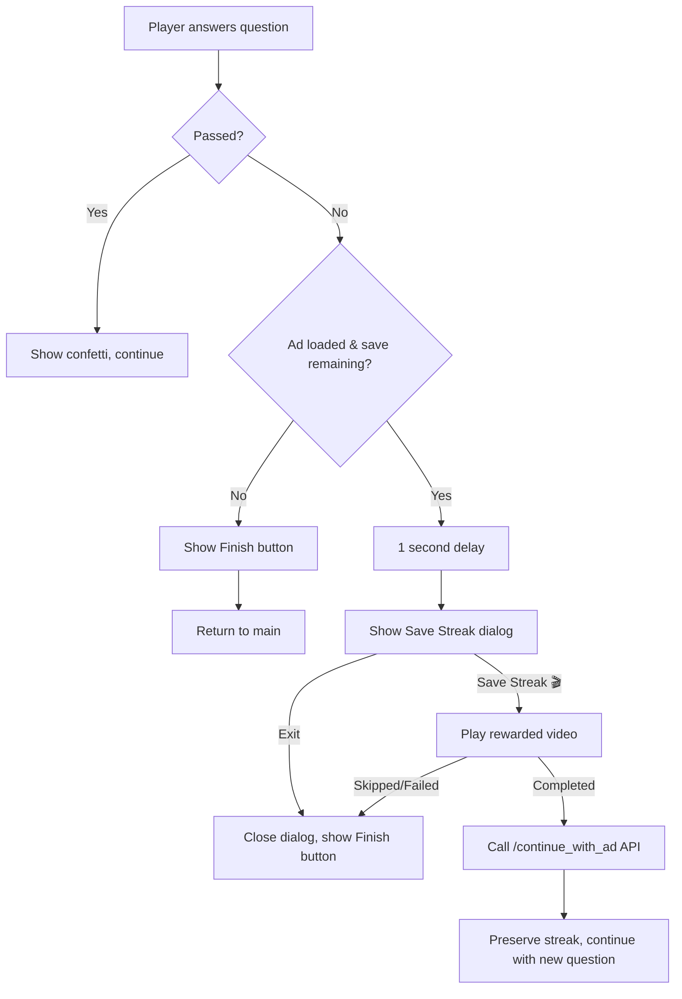

# Reward Video Ads: Save Survival Streak - Walkthrough

## Summary

Implemented a "watch ad to continue" feature for Survival mode using Unity Ads. When a player fails (scores below median), they can watch a rewarded video ad to save their streak and continue their run (max 1 save per run).

---

## Changes Made

### Backend (Python/FastAPI)

| File | Change |
|------|--------|
| [survival.py](file:///home/mo/repos/leverai/fermi-gen/packages/fermi-db/fermi_db/models/survival.py) | Added `ad_saves_used: int = 0` field to [SurvivalRun](file:///home/mo/repos/leverai/fermi-gen/packages/fermi-db/fermi_db/models/survival.py#9-35) model |
| [add_ad_saves_to_survival_runs.py](file:///home/mo/repos/leverai/fermi-gen/packages/fermi-db/alembic/versions/add_ad_saves_to_survival_runs.py) | **[NEW]** Migration to add `ad_saves_used` column |
| [survival_run_repository.py](file:///home/mo/repos/leverai/fermi-gen/packages/fermi-db/fermi_db/repositories/survival_run_repository.py) | Added [reopen_run_with_ad()](file:///home/mo/repos/leverai/fermi-gen/packages/fermi-db/fermi_db/repositories/survival_run_repository.py#114-132) method |
| [survival.py](file:///home/mo/repos/leverai/fermi-gen/apps/fermi-api/app/services/survival.py) | Added [continue_run_with_ad()](file:///home/mo/repos/leverai/fermi-gen/apps/fermi-api/app/services/survival.py#271-352) service method |
| [survival.py](file:///home/mo/repos/leverai/fermi-gen/apps/fermi-api/app/schemas/survival.py) | Added [ContinueWithAdRequest](file:///home/mo/repos/leverai/fermi-gen/apps/fermi-api/app/schemas/survival.py#111-115) and [ContinueWithAdResponse](file:///home/mo/repos/leverai/fermi-gen/apps/fermi-api/app/schemas/survival.py#117-126) schemas |
| [survival.py](file:///home/mo/repos/leverai/fermi-gen/apps/fermi-api/app/api/v1/endpoints/survival.py) | Added `POST /survival/continue_with_ad` endpoint |

---

### Frontend (Flutter/Dart)

| File | Change |
|------|--------|
| [pubspec.yaml](file:///home/mo/repos/leverai/fermi-gen/apps/fermi-frontend/pubspec.yaml) | Added `unity_ads_plugin: ^0.3.28` |
| [ad_service.dart](file:///home/mo/repos/leverai/fermi-gen/apps/fermi-frontend/lib/services/ad_service.dart) | **[NEW]** Unity Ads service singleton |
| [Info.plist](file:///home/mo/repos/leverai/fermi-gen/apps/fermi-frontend/ios/Runner/Info.plist) | Added 78 SKAdNetwork IDs for iOS attribution |
| [main.dart](file:///home/mo/repos/leverai/fermi-gen/apps/fermi-frontend/lib/main.dart) | Initialize AdService after Firebase |
| [api_service.dart](file:///home/mo/repos/leverai/fermi-gen/apps/fermi-frontend/lib/services/api_service.dart) | Added [survivalContinueWithAd()](file:///home/mo/repos/leverai/fermi-gen/apps/fermi-frontend/lib/services/api_service.dart#535-555) method |
| [survival_screen_controller.dart](file:///home/mo/repos/leverai/fermi-gen/apps/fermi-frontend/lib/screens/survival/survival_screen_controller.dart) | Added `canUseAdSave`, [continueWithAd()](file:///home/mo/repos/leverai/fermi-gen/apps/fermi-frontend/lib/screens/survival/survival_screen_controller.dart#348-424) |
| [survival_screen.dart](file:///home/mo/repos/leverai/fermi-gen/apps/fermi-frontend/lib/screens/survival/survival_screen.dart) | Added "Save Streak 🎬" dialog on failure |

---

## Configuration

**Unity Ads Game IDs:**
- Android: `6031846`
- iOS: `6031847`

**Placement IDs:**
- Android: `Rewarded_Android`
- iOS: `Rewarded_iOS`

**Test Mode:** Automatically enabled in debug builds (`kDebugMode`)

---

## User Flow



---

## Testing Instructions

### 1. Run Database Migration

```bash
cd /home/mo/repos/leverai/fermi-gen/packages/fermi-db
uv run alembic upgrade head
```

### 2. Test on Android Emulator

```bash
cd /home/mo/repos/leverai/fermi-gen/apps/fermi-frontend
fvm flutter run -d emulator-5554
```

### 3. Test Flow

1. Start a Survival run
2. Submit an intentionally bad answer (e.g., 1 for a question expecting millions)
3. Wait for result → after 1 second, should see "Save Streak 🎬" dialog automatically
4. Click "Exit" → dialog closes, you remain on survival screen with Finish button
5. Start again. Fail, then click "Save Streak" → test ad plays
6. After ad completes → run should continue with new question, **streak is preserved**
7. Fail again → should only see "Finish" button (ad save exhausted), **no dialog appears**
8. Return to pre-survival screen → **best streak reflects your preserved streak**

---

## Remaining Work

- [ ] Add backend unit/integration tests for [continue_run_with_ad](file:///home/mo/repos/leverai/fermi-gen/apps/fermi-api/app/services/survival.py#271-352)
- [ ] Production testing with real Unity ads
- [ ] Analytics/tracking for ad impressions and completions
